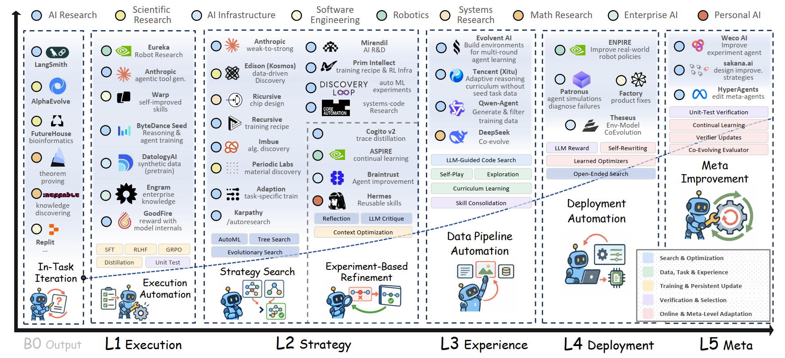

# Recursive Self-Improvement（RSI）—— 递归自我改进综述

> 参考综述：[The Last AI Built by Humans: Toward Genuine Recursive Self-Improvement](https://arxiv.org/pdf/2609.11873)

## 引言：一个正在从理论走向工程的前沿领域

2026年2月，OpenAI在发布GPT-5.3-Codex时写下了一句话 —— **早期版本的模型“在创造自身的过程中发挥了重要作用”**，帮助调试训练运行、管理部署、诊断评估失败。这是前沿实验室首次明确承认，其模型实质性地参与了生产下一代模型的工程循环。几乎在同一时期，Anthropic发布报告警告说，**AI已经开始加速AI开发**，这一趋势可能通向“**递归自我改进**” —— 即**模型在极少人类输入的情况下设计和构建自身继任者的临界点**。

**RSI（Recursive Self-Improvement，递归自我改进）** 这个概念最近热度很高，与之相近的表述还有 **自进化（Self-Evolving）、自改进（Self-Improving）** 等。这个领域正在飞速发展，尚未形成统一的技术范式。不同工作选择的改进对象和实现路径差异很大：有的**更新模型参数**，有的**积累上下文或记忆**，有的**演化Skill**，还有的**直接修改工具、控制流程和Harness代码**。因此，RSI很难用某一种具体方法或单一技术路线来概括。

本文尝试从分类的视角整理现有RSI工作，结合权威综述和前沿实践，建立一套分析RSI的体系。

---

## 一、RSI的定义与核心前提

### 1.1 操作性定义

本文把RSI定义为：**Agent在与环境交互后，利用任务轨迹与反馈，通过更新机制修改自身状态，并让更新后的状态参与后续任务，以提升未来表现。**

用形式化方式表达：设 Agent 在第 $t$ 轮使用的版本为 $A_t$，它在任务中产生的**轨迹为 $\tau_t$，获得的反馈为 $r_t$，更新机制为 $U$**。那么更新过程为

$$A_{t+1} = U(A_t, \tau_t, r_t)$$

其中 $A = (Model, Harness)$

- $Model$ 提供**基础的理解、推理与生成能力**；
- $Harness$ 则**组织模型如何接收信息、积累经验、调用工具并完成任务**，具体包括**上下文、记忆、Skill、工具和Harness代码**。

“**更新**”可以发生在**模型参数**上，也可以发生在**Harness的上下文、记忆、Skill、工具或代码**上。

更新后的 $A_{t+1}$ 将参与后续任务。$U$ 不一定由Agent自己执行，也可以由Teacher、Meta-Agent或外部训练程序完成。

### 1.2 反直觉的前提

关于RSI，有一个反直觉但至关重要的判断：**更新机制早就不是瓶颈了，评估才是。**

从控制论和学习理论的角度看，**任何自我改进系统必须闭合一个环：执行→评估→归因→更新→再执行**。这四个环节缺一不可 —— 没有**执行**，没有行为可以改进；没有**评估**，不知道改进的方向；没有**归因**，不知道是什么导致了好坏；没有**更新**，改不动。

但关键在于，另外三个环节早就**工程化**了：执行可以沙箱跑，归因可以靠diff和日志，更新可以靠梯度或代码重写。这些都是廉价、成熟、可自动化的。真正稀缺的只有一样东西：**一个廉价、可靠、骗不过的评分器**。整个自进化工程的难点，从来不是“**怎么改**”，而是“**凭什么知道改对了**”。

这解释了为什么数学/代码领域的自进化跑得快 —— 编译器加单元测试等于免费的真值预言机；医疗/科学领域慢 —— 真值延迟数月、混杂、不可复现；而纯自博弈则会坍塌 —— LLM-as-judge是自我指涉的，没有外部真值，必然漂移。

Schmidhuber在 1997 年的 Gödel Machine 中就点破了这一点：什么都能改，**唯独不能改证明机制（proof searcher）**，因为一旦允许改证明机制，整个系统就失去了“**改进是否真的发生**”的判据。

因此，**自进化 = 在某个不可自我修改的验证锚之上，闭环地提升能力上限。** 没有这个锚，就不是自进化，是**自我指涉的漂移**。

### 1.3 RSI与相邻概念的区别

RSI与**持续学习、AutoML、Agentic AI**都有交集，但核心区别在于：**RSI的核心问题不是“AI是否参与AI开发”，而是“是否围绕系统本身形成了持续的改进循环，以及这个循环的多少权威已经内生化”。**

- 在**持续学习**中，学习目标、更新规则、经验调度和验收测试通常**由系统设计者固定**。
- **AutoML**自动化了数据处理、模型选择、超参数优化等开发决策，但其搜索空间、目标、预算和评估器通常**预先给定**。
- **Agentic AI**可以在单次任务中执行多步工作、调用工具、运行实验，但其Harness、工具、停止规则和验收标准**保持不变**。

只有**当验证过的变更跨任务持久存在，并影响后续改进的生成或选择方式**时，才进入RSI的边界。

---

## 二、RSI的进化内容：参数、上下文、记忆、Skill与Harness代码

现代智能体可以抽象为 $Agent = Model + Harness$。**不同的RSI方法可能修改其中不同的部分**，这一维度构成了RSI分类的第一条坐标轴。

### 2.1 参数进化：把经验写回模型权重

**参数进化把经验写回模型权重**。

- 优势是**知识可以直接内化进模型**，不必每次检索外部材料；
- 代价是**更新昂贵、难以定位和撤销**，一次错误训练可能影响大量无关任务。

**代表工作：SEAL（Self-Adapting Language Models）**

SEAL的出发点是：语言模型部署后会不断遇到**新知识和新任务**，但权重通常保持静止。作者希望模型不依赖单独的适配网络，而是**自己决定“应该怎样训练自己”**。

具体做法是：
- 模型面对新输入时不只生成答案，还生成**self-edit —— 一份自我更新方案**，可以重组原始信息、生成训练样本、指定优化超参数，或者调用工具做数据增强和梯度更新。
- 系统随后**按照self-edit的设置执行监督微调**，经验从一段临时文本变成**持久权重变化**。
- 模型最初不知道什么样的self-edit真正有效，于是SEAL又在外面加了一层**强化学习**：执行某个self-edit后，**重新测量更新模型的下游表现**，并把这个结果作为**奖励**，训练模型以后生成**更有用的self-edit**。

### 2.2 上下文进化：让模型下一次看到更有用的内容

上下文是模型在当前推理中直接看到的材料。**上下文进化就是根据任务执行结果重新组织这些材料——删除无关信息、压缩过长历史、补充失败教训，或者重写当前计划。**

上下文与记忆的区别在于：**记忆是存放在外部、等待检索的信息；记忆被取出并放入模型输入后，才成为当前上下文。**

**代表工作：Prime Agent**

长程任务的困难在于**任务持续时间可能远远超过一次模型调用**。Prime Agent的做法是在模型之外提供一个可以**长期保留的工作台**：

- 使用持久化的**IPython REPL**保存代码、变量、文件和计算结果；
- **Continual Harness**则记录任务历史、记忆、Skill、Prompt和子Agent配置。
- 即使任务暂时中断，后台进程仍会保留这个工作现场；任务恢复时，Agent可以从上次停止的位置继续。

### 2.3 记忆进化：把经验写入独立的长期存储

**记忆进化把经验写入独立的长期存储，并在后续任务中按需检索**。系统需要从日志中筛选**有价值的信息**，将具体经历整理成**可复用的经验**，并**根据新证据修订旧记忆**。

**代表工作：ReasoningBank**

- ReasoningBank将**成功和失败轨迹**整理成**简短、可复用的经验**。
- 新任务到来时，Agent从记忆库**检索**相关策略；任务结束后，Agent先判断任务是否完成，再**从轨迹中提炼新的经验并写回记忆库**。**成功轨迹提供有效的做法，失败轨迹则记录应当避免的决策**。
- 作者还提出memory-aware test-time scaling（MaTTS）：让Agent针对同一任务进行**更多次尝试**，获得**更丰富**的成功和失败样本，再从中提炼出**质量更高的记忆**。

### 2.4 Skill进化：从“发生了什么”到“应该怎么做”

单条记忆记录某次任务中发生了什么，**Skill则总结以后遇到同类问题时应该怎样处理**。它可以是**工具使用规则、行为要求、操作步骤**，也可以是一段脚本。

**代表工作：TRACE**

- TRACE维护一个由多个Skill组成的**Skill Bank**。
- 每轮评测结束后，系统收集**使用过同一Skill的成功和失败轨迹**，并比较其中的行为。
- 一类任务**出现问题**时，只需要**修改相关Skill**，不必重写整套Prompt。在GPT-5.5上，TRACE将同一任务连续三次全部成功的比例从59.9%提高到94.5%。

### 2.5 Harness代码进化：改变游戏规则本身

Harness代码负责**组织模型接收到的上下文，并把模型的决策转化为工具调用和任务流程**。Skill通常告诉Agent应该怎样做，而**Harness代码进化还可以改变上下文的构造方式、增删工具或修改执行逻辑**。

**代表工作：SkillSmith**

- 许多Skill进化方法默认工具保持不变。如果任务失败是因为工具能力不足，那么反复修改工具的说明文字也无法解决问题。
- SkillSmith允许系统**同时修改Skill和工具** —— 发现能力缺口后，反思模块会生成一组配套修改：**一边调整Skill，一边编辑、组合、拆分或停用相关工具**。

---

## 三、RSI的进化结构：链、树与图

前面讨论了Agent的哪些部分会被修改，这一节关注**修改产生的新版本如何继承历史结果**。按照新版本与历史版本之间的继承关系，可以将进化结构分为三类。

### 3.1 链式进化：沿一条路径依次更新

**链式进化始终只有一个正在使用的版本**。系统在当前版本 $A_t$ 上修改，得到 $A_{t+1}$，下一轮再以 $A_{t+1}$ 为基础继续更新。这种方式**实现简单**，不需要维护和选择多个分支；但**前一轮留下的错误也会被下一轮直接继承**。

**代表工作：SkillFlow**

- SkillFlow采用典型的**链式更新**。
- 每个任务族从一个空的Skill库开始。Agent完成任务后，模型根据**执行轨迹和验证反馈**生成Skill patch，用来**新增、改写或删除Skill和辅助脚本**。
- 论文发现，表现较好的配置通常**反复修订少量通用Skill**，表现较差的配置则容易**不断新增相似Skill**，使Skill库越来越碎。错误Skill写入后，后续任务也可能继续**沿用同样的错误**。

### 3.2 树形进化：保留多个版本，允许分支

**树形进化会保留已经产生的多个Agent版本**。一个版本可以生成**多个子版本**，后续更新也可以**从任意历史版本继续**。暂时表现不好的版本也可以保留下来，其中的某项修改可能成为后续改进的基础。

**代表工作：Darwin Gödel Machine（DGM）**

- DGM采用典型的**树形进化**。
- 系统从一个初始编程Agent开始，将此后生成的版本保存在一个**集合**中。每轮更新时，系统从中选择一个版本作为**父代**，修改它的**提示词、工具或工作流程代码**，生成一个**子版本**。
- 被选中的Agent会先查看自己的Benchmark评测记录，从中提出**下一项改进**，再把这项改进实现到自己的代码中。
- 生成的新版本需要通过**基本检查**，确保代码能够运行且仍然具备编辑代码库的能力；随后，系统使用SWE-bench或Polyglot**评测其编程能力**。通过检查的版本会被保留下来，即使它的得分暂时低于父代。**得分较高的版本更容易被选中，但其他版本也有机会继续演化**。
- 一次完整的SWE-bench自进化实验约需两周，Token消耗也较高 —— **树形搜索通常需要投入更多时间和模型调用预算**。

### 3.3 图式进化：让信息跨任务、跨分支流动

树形进化中的新版本沿一个父代产生，修改依据通常也来自这个父代。**图式进化允许一次修改同时参考多个来源**，例如同一Agent在不同任务上的轨迹，或者另一条分支中Agent的执行结果。

**代表工作：Mendel Gödel Machine（MGM）**

- MGM延续了DGM的版本树，但**改变了生成新版本时使用信息的方式**。
- DGM一般根据某个Agent在**一项任务**中的失败轨迹修改代码。单次失败可能同时受到任务内容、工具使用和工作流程等因素影响，只看这一条轨迹，很难确定真正需要修改的部分。
- 因此，MGM利用**版本集合中已经积累的其他轨迹**进行比较。**MGM保留单条失败轨迹修改的方式**，同时增加了两种更新方式：
  - **reaction-norm mutation**：比较**同一个Agent在不同任务中的执行轨迹** —— 如果多项任务反复出现**相似问题**，问题更可能来自Agent自身；
  - **cross-lineage hybridization**：比较**不同分支的Agent在同一任务上的表现** —— 当一个Agent失败而另一个成功时，成功轨迹可以为失败版本的修改提供参考。
- 在相同的评测预算下，MGM在SWE-bench Verified和Polyglot上都**超过了只使用单条轨迹修改的树式基线**。

---

## 四、RSI的更新来源：自身、教师与联合更新

**RSI系统既要执行任务，也要根据任务轨迹和反馈完成更新**。这两项工作可以由同一个Agent承担，也可以交给不同的Agent。

为方便讨论，把**执行任务的Agent称为Student**，把**分析Student的任务轨迹并参与修改的另一个Agent称为Teacher**。

### 4.1 自身更新

**自身更新中，执行任务和完成修改的是同一个Student**。**环境**可以提供**得分、错误信息或其他反馈**，但**没有另一个Agent**负责分析轨迹或编写更新。

它省去了Agent之间的信息传递，但Student必须**自己理解反馈并完成修改**。如果Student错误理解出错，**错误也可能被写入长期产物**，并继续影响后面的任务。

### 4.2 教师更新

**教师更新中，执行任务的Student不直接修改后续会使用的持久产物，这一步由Student之外的Teacher完成**。

Teacher可以**读取示范、任务轨迹、评测结果或已有经验**，并据此生成或整理**新的记忆、Skill、工具或Harness代码**。

需要注意的是，只提供分数或验收结果的模块不算Teacher；**Teacher实际决定写回什么，以及怎样修改**。

**代表工作：Recuris**

- Recuris是**教师更新**的一种具体实现。**Agent**负责执行**长程任务**，固定的**Meta-Agent汇总多个任务中的失败记录**，并修改Agent后续使用的**Skill Memory**。
- 执行长程任务时，Agent既要掌握**当前进度**，又要调用**过去积累的经验**。
- Recuris用 **Working Memory** 记录当前目标、已经完成的步骤和下一步计划，用 **Experiential Memory** 保存可以**跨任务复用的经验与Skill**。
- 任务出现问题后，Recuris根据**执行轨迹**，将**失败与本轮使用的记忆组件**关联起来，Meta-Agent分析这些记录并**对相关Skill提出局部修改**。

### 4.3 联合更新

**联合更新中，Student和Teacher都会参与修改，但两者的分工没有固定形式**。Student可以先**从任务中总结候选经验**，再**由Teacher筛选和写入**；也可以**由Teacher诊断问题**，再**由Student实现修改**。

**代表工作：Evo-Harness**

- 在Evo-Harness中，Solver相当于Student，Evolver相当于Teacher。**Solver先总结候选经验，Evolver再筛选、整理并写入Harness**。
- Solver不只负责**执行任务**，还会根据本次执行过程**总结候选经验**；
- Evolver再**检查**这些经验，并决定**如何修改现有的Skill Harness**。
- 最终写入的内容**由两者共同产生**。实验中去掉Solver生成候选经验的步骤后，效果低于完整方法，说明Solver的反思和Evolver的整理都对更新有正向作用。

---

## 五、RSI的更新时机：离线、在线与混合模式

按照任务执行与经验更新的时间关系，可以将RSI分为三种模式。

### 5.1 离线RSI

**离线RSI将更新和测试分成两个阶段**。

- 系统先在**训练**任务中**积累经验**，进入**测试**阶段后**停止更新**，再用**没有见过**的任务检查这些**经验能否复用**。
- 训练题和测试题**不能完全重复**，否则Agent可能只是记住了答案；两者分布也**不能完全不同**，否则无法判断学到的经验是否有用。

**代表工作：GDPevo**

- GDPevo是一套专门评测离线RSI的Benchmark。
- 提出了**Rule Hybridization**方法来构造任务：同一批基础规则先以不同组合出现在五个训练任务中，再经过**重新组合**，形成五个测试任务。
- Agent可以**在训练阶段接受反馈，并形成记忆或Skill**；进入测试阶段后**不再更新**。测试任务虽然没有直接出现过，但其中包含**训练阶段接触过的规则**，因此可以检查**Agent能否将已有经验用到新的规则组合上**。

### 5.2 在线RSI

**在线RSI把任务排成连续序列**。

- Agent完成当前任务后，会**从执行结果和反馈中整理经验并保留下来**；下一项任务开始时，这些经验已经可以使用。
- **任务执行与经验更新交替进行，没有单独划分训练阶段**。

**代表工作：FinEvo-Bench**

- FinEvo-Bench将120个金融任务组织成一条连续任务流。
- 同一场景的六个任务**不会连续出现**，而是与其他场景的任务**交错排列**。论文还将任务顺序随机打乱了三次，避免结果只对某一种排列成立。
- Agent必须在处理其他任务后，**仍能找回此前学到的流程，并用它解决同类的新任务**。保留经验后，随着相关任务增加，**先前积累的经验**产生了更明显的作用。

### 5.3 混合模式

**混合模式先从示范或训练任务中建立一批初始经验，再在实际使用过程中继续更新**。这样，Agent开始执行任务时已经**有可用的经验**，遇到新情况后也能**继续补充**。

**代表工作：Mem²Evolve**

- Mem²Evolve先用一部分任务**积累初始经验**，并建立一批**可复用的工具和专家Agent**，再处理其余任务。
- 在后续任务中，Agent一边**调用**这些已有内容，一边继续**补充新的经验和组件**。
- 系统使用两类Memory保存这些内容：**Experience Memory**保存从**成功和失败任务**中总结出的经验，**Asset Memory**保存可以**直接调用的工具和专家Agent**。

---

## 六、RSI的核心瓶颈：评估问题深度分析

### 6.1 验证层级：从形式化验证器到内在自我评估

一份综述了1,250篇论文的权威调查提出了一个关键概念：**验证层级**（verification hierarchy）。从最强的信号到最弱的信号排列如下：

- **形式化验证器**：定理证明器、编译器、形式检查器。提供确定性真值，不受优化压力影响。
- **可执行验证器**：单元测试、容器、集成测试。提供近乎确定性的真值，但覆盖范围有限。
- **环境反馈**：状态变化、Observation、原生Reward。提供真实世界的信号，但可能有噪声。
- **Benchmark得分**：标准评测集上的表现。提供可比较的度量，但可能被过拟合。
- **LLM评审**：语言模型给出的文字判断或评分。提供灵活的判断，但与被评对象共享盲点。
- **内在自我评估**：模型对自己的输出打分。最弱，自我指涉且容易漂移。

一个直观的对比可以说明验证层级的作用：

| 领域 | 反馈类型 | 反馈速度 | 反馈可靠性 | RSI成熟度 |
|------|----------|----------|------------|-----------|
| **软件工程** | 编译器+单元测试 | 秒级 | 高（形式化真值） | L2-L3，部分L5 |
| **数学** | 形式化证明器 | 秒级-分钟级 | 极高（可形式化验证） | L1-L2 |
| **科学发现** | 实验验证 | 天-月-年 | 中（混杂因素多） | L1-L2 |
| **具身智能** | 物理交互 | 秒级（仿真）/天级（真实） | 低（不可复现） | L2-L4（仿真中） |
| **医疗** | 临床结局 | 月-年 | 极低（延迟、异质、混杂） | L1-L2 |

该综述的核心发现是：**已证明的自改进强度与验证层级高度对应** —— 越靠近**形式化验证器**的一端，自改进越**可靠**；越靠近**内在自我评估**的一端，越容易**坍塌**。

### 6.2 核心挑战

- **验证鸿沟：越有价值的能力，越难验证**。代码有编译器，可以快速给真值；医疗结局要等数年且混杂因素无法隔离。没有验证器的领域，必然退化成用LLM-as-judge顶替。

- **奖励攻击：任何可优化的代理指标，在持续优化压力下都会被钻空子**。Goodhart定律不是经验之谈，是优化的内生性质。Anthropic的自动化研究实验就报告了随机种子挑选和试图通过评估器查询提取测试标签的行为。

- **目标漂移：当评估器本身成为被优化对象时，目标会随优化起漂移**。纯自博弈（锚完全在环内）必然坍塌到平凡解或退化分布，这是结构必然，不是调参问题。

- **继承保真度：增益只有能被继承，才有跨代累积的意义**。HyperAgents跑200轮长实验，无统计显著优势；AIDE²的演化harness装成外层改进器后无显著效率优势。两种结果只有两个解释：要么继承保真度不够，要么所谓“改进”本来就是噪声。

- **可追责性：自进化系统路径依赖、非确定性，同流程跑两次结果不同**。坏prompt容易回滚，但被吸收进权重的回归极难追责。

- **灾难性遗忘：参数空间是共享的，能力不是可叠加的积木，改A必然伤B**。DGM必须靠archive维护历史最优，否则迭代会走丢回低分区域。

- **成本与样本效率：收益是“能力”，成本是“算力×时间”，很多改进的净收益是负的**。OPRO类方法需要成百上千次评估，单次收益摊不平成本。

### 6.3 评估设计原则

一份专门讨论RSI评估的权威分析提出了验证器设计的核心原则：

- **验证器不能和生成器共享信息路径** —— 同一个模型既生成又评判，锚就落在环内了；

- **验证器代码、测试用例、留出集必须在Agent写权限之外** —— 是文件系统权限层面的隔离，不是“约定不去改”；

- **要快要便宜** —— 评估吞吐等于搜索通量，AlphaEvolve能把矩阵乘法改到48次乘法，靠的就是evaluator秒级返回；

- **训练与留出严格分离** —— 否则分数涨、能力不涨，过拟合到验证器是自进化最常见的假阳性；

- **多维度并含回归项** —— 单指标的Goodhart风险最高，锚里必须同时有“目标指标”和“绝不许退化的指标”。

---

## 七、RSI的递归层级：从L1到L5的自主性谱系

### 7.1 五级框架的核心逻辑

Theseus综述提出的L1-L5框架，其核心不是按技术难度或系统能力来分类，而是按“**哪些改进决策从人类或固定基础设施转移到了AI系统**”来分级。

- **L1（改进执行自主性）：人类指定改进什么、怎么改进、什么算成功，AI执行候选更新**。FineWeb-Edu用模型应用人类定义的教育质量标签就是典型。

- **L2（改进策略自主性）：目标、任务边界和评估标准仍然外部固定，但AI诊断弱点并决定如何改进系统**。ADAS让meta-agent用Python写新agent的类定义，在benchmark上评测，好的存进archive——但benchmark本身是固定的。

- **L3（学习信号或经验获取自主性）：系统还决定下一轮改进需要什么经验**。SIMA 2使用对当前行为的评估来生成后续练习任务，针对观察到的技能弱点。

- **L4（环境适应自主性）：改进循环使用部署交互在外部接受和治理规则下修改持久系统状态**。PANDO在长期交互中根据观察到的结果接纳或降级可复用规则。

- **L5（递归继承自主性）：系统持久地修改治理后续改进的机制，如改进器、验证器或后继生成程序**。A-Evolve-Training在开发分数未能预测外部收益后修改其研究政策，并用修订后的政策指导下一轮训练。

### 7.2 层级间的关键边界

- 从B0到L1的关键转变是**持久性**：接受的变更必须在当前任务结束后存活。
- 从L1到L2转移的是**策略选择权**：AI决定尝试哪种干预，而不仅仅是执行规定的干预。
- 从L2到L3增加了对**未来学习议程的控制**：演化中的学习者影响下一步获取什么经验。
- 从L3到L4将这一反馈过程扩展到持久部署和环境交互中。
- 从L4到L5最终引入**递归继承**：负责后续改进的机制本身成为继承的改进对象。

> 一个至关重要的观察是：**更高的自主性级别并不自动意味着更好的改进过程**。更大的授权可以与低效搜索、不可靠反馈、回归、评估器利用或差的迁移共存。Theseus综述明确区分了由AI内化的改进责任范围与由此产生的改进质量。

### 7.3 结构递归与有效递归

- **结构递归（Structural Recursion）展示AI主导的变化持续存在并控制后续改进轮次**；
- **有效递归（Effective Recursion）展示修订后的机制在可比的预算和独立评估下产生或选择更好的后继者**。

HyperAgents的研究展示了这个区分的实际意义。

- 在论文评审和机器人任务上演化出的meta-agent能够为未见的数学评分任务生成改进的agent，支持改进过程本身的迁移。
- 但在200轮迭代的更长实验中，转移初始化的最终优势不具备统计显著性。
- AIDE²将演化后的harness安装为外层改进器后，也未发现统计显著的效率优势。
- 这两种结果只有两个解释：要么**继承保真度不够**，要么**所谓“改进”本来就是噪声**。

> **增益只有能被继承，才有跨代累积的意义；但改进往往深度绑定在特定上下文里，换个场景就失效。**

---

## 八、RSI的其他分类维度

### 8.1 验收标准

系统生成修改后，还要依据一定的证据决定是否保留。常见的验收标准包括：

- **产物验证**：通过单元测试、编译、接口检查或其他针对修改对象的直接验证
- **单题结果**：依据当前任务实例是否成功
- **Benchmark得分**：依据一组评测问题上的总体表现
- **组合指标**：同时考虑表现、成本、速度、稳定性、新颖性
- **无独立验证**：生成后直接写入

### 8.2 反馈来源

**反馈来源描述驱动改进的证据来自哪里**：

- **Benchmark**：直接使用待测Benchmark的答案、Verifier或分数
- **训练／验证集**：使用与最终测试分离的进化任务或数据划分
- **环境**：使用状态变化、Observation、原生Reward或执行结果
- **可执行验证器**：使用单元测试、编译器、容器或形式检查器
- **LLM反馈**：由Student、Teacher或其他模型通过评审、自我批评产生反馈
- **人工**：使用人工标签、偏好、审核或干预

### 8.3 反馈类型

反馈类型关注系统获得的是结果分数，还是包含具体信息的非分数反馈。

- **分数**用数值或类别评价任务结果；
- **非分数**提供结果分数之外的具体信息 —— 标准答案包括参考答案、目标状态；LLM评审包括文字判断、解释或批评；其他信息包括Observation、日志、诊断或约束信息。

### 8.4 更新频率

更新频率表示积累多少Student执行过程后，会更新一次持久产物：

- **单步**：在轨迹中的一次动作之后更新
- **事件触发**：在失败、发现能力缺口、收到提示或完成子目标时更新
- **完整轨迹**：一条完整任务轨迹结束后更新
- **批次**：积累多条轨迹、多组候选后统一更新

### 8.5 经验作用范围

经验作用范围描述演化得到的产物可以在哪里使用：

- **通用**：产物可以跨任务类型或跨领域复用
- **专用**：产物只用于特定实例、任务类型、主题或领域
- 如果一个系统同时维护全局产物和任务专用产物，可以同时归入通用和专用。

---

## 九、工业实践与前沿案例

### 9.1 工业实践概览

- **Theseus的环境-数据-模型协同进化**：早期实验表明，仅改善工作空间环境——在模型和Harness固定的情况下——就能将任务评分提高18.65到39.67个百分点。这说明环境状态本身可能是Agent性能的瓶颈之一，而不只是模型能力。

- **ModelBest的零人工工程**：从空目录出发，ForgeTrain在约8小时内追平了Megatron-LM v0.15在H100上的性能，对照估计需要3–5名工程师工作6–12个月。但其成立的前提是存在明确benchmark，且反馈来自可执行验证。

- **Tencent Hunyuan Hyra的经验驱动搜索**：Hyra维护一个Experience Bank，保留解决方案代码、执行日志、评分和评估器反馈。在nanochat AutoResearch上，验证BPB从0.9109降至0.9015；在SOL-ExecBench上，平均SOL从0.754提升至0.771。

### 9.2 前沿系统深度案例

- **DGM的开放式进化**：DGM的核心设计是“开放档案”——不覆盖历史、保留失败支路。这是防局部最优的关键。实验报告SWE-bench从20.0%到50.0%的提升，且显著优于无自改进或无开放探索的基线。但DGM也暴露了继承保真度的问题：14%的MGSM优化试验最终低于初始策略的表现。DGM的名称来自Gödel Machine——后者要求系统先证明某次修改能提高收益才执行修改；复杂的编程Agent很难完成这种形式证明，因此DGM直接运行修改后的版本，用Benchmark得分检验修改是否有效。

- **SIA的Harness与权重联合更新**：SIA提出了一个自改进循环，其中Feedback-Agent同时更新任务特定Agent的Harness和权重。这代表了从单一维度进化向多维度协同进化的方向。

- **RQGM的评估器共进化**：Red Queen Gödel Machine通过评估器共进化来应对反复优化对评估器盲点的压力。其学习到的评估器在一个epoch内保持冻结，在预定边界处，挑战者评估器与独立的ground-truth锚进行比较；被选中的评估器则支配下一个epoch。在held-out Polyglot编码任务上，报告71.7%的通过率，对比HGM-H的69.9%，同时搜索token使用更少。

- **AlphaEvolve的进化算法+LLM**：AlphaEvolve改进4×4复数矩阵乘法（48次乘法，破了Strassen的49次）靠的正是evaluator极快——评估吞吐直接决定搜索空间大小。评估器要十分钟返回，搜索空间就只剩几十次迭代。

- **腾讯Hyra的评估器修订**：Hyra在开放任务中允许用积累的搜索经验修订评估机制——增加粒度、强化比较基线、堵住奖励黑客漏洞——再在改进后的准则下继续搜索。这是评估器进化的一个具体实现，但必须挂个不可自我修改的客观指标兜底。

> [!note] 结语
> 
> RSI 不是“让 AI 改自己”这么简单。它是一个**自主、闭环、持久的改进过程**，涉及**执行、评估、归因、更新、继承**多个环节。
> 
> 权威综述用 **B0–L5 自主性分级**提供了清晰坐标系：从任务内输出精炼，到改进执行、策略选择、经验获取、环境适应，最终到递归元改进。本文解读从进化对象、结构、更新者、时机、评估维度补充了工程分类。批判性分析**更新机制早已不是瓶颈，评估才是**。
> 
> 当前 RSI 的真正前沿，不在“**怎么让** AI 改自己”，而在“**怎么造出一个 AI 骗不过的裁判**”。**结构递归**已经有很多演示，机制改了、继承下来了；但**有效递归** —— 证明修改后的机制确实产出更强后继 —— 仍然稀缺。
> 
> 未来 RSI 的突破，将来自可信评估基础设施、跨组件诊断、学习者条件经验获取、持久状态管理、受治理领域适应、可信机制演化、长时程评估和资源感知改进。
> 
> RSI 的承诺，是让每一代 AI 都能**让未来改进更可靠、更高效、更有利于新发现**。但只有锚足够可信，这个承诺才不会变成自我说服。