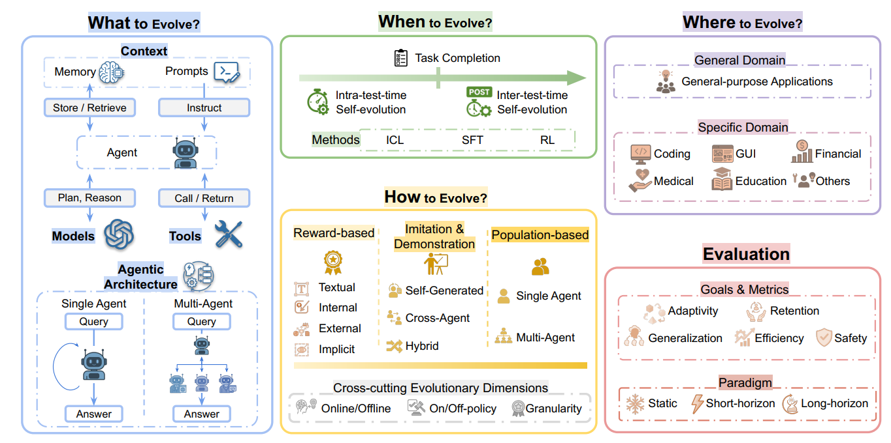

# Self-Evolving Agents (What、When、How、Where) —— 自进化智能体综述

> 参考综述：[A Survey of Self-Evolving Agents: What, When, How, and Where to Evolve on the Path to Artificial Super Intelligence](https://arxiv.org/pdf/2507.21046)
> 
> 原文系统梳理了自进化智能体的定义、分类、方法、评估、应用与未来方向。本文聚焦四个核心问题：**进化什么（What）**、**何时进化（When）**、**如何进化（How）**、**在哪里进化（Where）**，并辅以评估体系、开放挑战与未来方向的深度讲解。

## 引言：为什么需要自进化智能体？

### 从静态模型到动态智能体

大语言模型（LLM）在过去几年展现出惊人的通用能力：写代码、做推理、调用工具、进行多轮对话。但它有一个根本性限制：**模型本身是静态的**。训练完成后，参数不再变化。面对新任务、新知识、新环境，它只能依靠上下文、检索或外部脚手架，**无法真正把经验写回自身**。

这带来一个关键瓶颈：当 LLM 被部署到**开放式、交互式、持续变化**的环境中时，传统“**预训练 + 微调 + 推理**”的流水线不够了。人类工程师不可能为每一种新情况重新标注数据、重新训练、重新部署。智能体需要自己**从交互中学习、从反馈中调整、从经验中进化**。

“生存下来的不是最智慧的物种，也不是最强壮的物种，而是最能适应和调整自身以适应不断变化的环境的物种。” 达尔文的这句话点出了自进化智能体的核心精神：**适应即智能**。

### 自进化智能体的操作性定义

操作性定义：**自进化智能体是指能够基于自身轨迹或反馈信号，修改其内部参数、上下文状态、工具集或架构拓扑，并以改善未来性能为明确目标的智能体。**

这个定义有三个关键纳入标准：

1. **经验依赖**：更新由**轨迹、自生成数据或环境反馈**驱动，针对智能体自身的能力边界，而不是泛泛的数据合成。也就是说，智能体不是因为“**有更多数据**”而改进，而是因为“**经历了特定交互**”而改进。
2. **持久改变**：更新必须产生**持久的、改变策略的**效果，而不是一次性的指令遵循。比如，一次性的“请用更谨慎的语气回答”是暂时的；而把“谨慎”写入记忆或提示模板，则是持久的。
3. **自主探索**：系统需要具备**自主探索或自发学习机制**，即使它也使用预收集数据。自主探索意味着智能体可以自己决定“我需要学什么”“我应该生成什么训练数据”“我应该在哪个环节反思”。

### 自进化与其他学习范式的区别

比较自进化智能体与四个相关范式：**课程学习、终身学习、模型编辑、遗忘学习**。

- **课程学习**：按难度递增组织训练数据。它操作**静态数据集**，只更新**模型参数**；自进化智能体处理**动态环境**中的顺序任务，能**调整记忆、工具等非参数组件**。
- **终身学习**：**持续学习新任务同时保留旧知识**。它主要关注参数级持续学习，记忆多用于**训练时回放**；自进化智能体把记忆用于**测试时状态适应**，并**主动探索环境**。
- **模型编辑**：精准修改特定知识。它通常只改**局部参数**，**依赖预定义流程**；自进化智能体可以修改**非参数组件**，并自发采用**多样策略**。
- **遗忘学习**：移除隐私或有害信息。它关注特定知识的**删除**；自进化智能体关注系统级**持续适应**。

> 总结：**自进化智能体是系统级解决方案范式，把适应作为一等能力，跨越参数、上下文、工具、架构多个层面。**

### 形式化框架

**环境**：将智能体系统所处环境（包含用户、执行环境，例如 Linux 命令行）建模为**部分可观测马尔可夫决策过程 POMDP**：$E=(G, S, A, T, R, \Omega, O, \gamma)$，其中：

- $G$：**目标集合**。每个 $g\in G$ 代表智能体要完成的任务目标，例如用户查询；
- $S$：**状态集合**。每个 $s\in S$ 代表环境内部状态；
- $A$：**动作集合**。动作 $a\in A$ 可以是文本推理、外部知识检索、工具调用的组合；
- $T$：**状态转移概率函数**。输入 $(s,a)$，输出下一状态 $s'$ 的分布 $T(s'|s,a)$；
- $R$：$S\times A\times G \to \mathbb{R}$ **反馈 / 奖励函数**，依赖目标 $g\in G$；$r=R(s,a,g)$，一般是标量分数或者文本反馈；
- $\Omega$：智能体可观测的**观测集合**；
- $O$：**观测概率函数**，输入 $(s,a)$，输出下一条观测 $o'$ 的分布 $O(o'|s,a)$；
- $\gamma$：**折扣因子**。

**（多）智能体系统**：定义为 $\Pi=(\Gamma,\{\psi_i\},\{C_i\},\{W_i\})$

- $\Gamma$：**智能体系统的控制流**，或者多智能体协作结构，一般表示为图或者代码结构组织的节点序列 $(N_1,N_2,...)$；每个节点 $N_i$ 包含：
  1. $\psi_i$：**底层大语言 / 多模态模型**；
  2. $C_i$：**上下文信息**，例如提示词 $P_i$、记忆 $M_i$；
  3. $W_i$：**可用工具 / API 集合**。

- 在每个节点，**智能体策略**为函数 $\pi_{\theta_i}(\cdot|o)$，**输入观测，输出下一个动作的概率分布**；$\theta_i=(\psi_i,C_i)$。**动作空间**是自然语言空间与工具空间 $W_i$ 的并集。

- 给定任务 $T=(E,g)$（环境 E+ 目标 $g\in G$），智能体系统依照**拓扑结构** $\Gamma$ 生成**轨迹** $\tau=(o_0,a_0,o_1,a_1,...)$，接收来自**外部环境或者内部信号**（例如模型置信度、评估器反馈）的反馈 $r^*$。

**自演化策略**：自演化策略是**变换 $f$，基于生成轨迹 $\tau$、外部 / 内部反馈 $r$**，将当前智能体系统映射为新状态：

$$f(\Pi, \tau, r)=\Pi'=\left(\Gamma',\left\{\psi_{i}'\right\},\left\{C_{i}'\right\},\left\{W_{i}'\right\}\right)$$

**自演化智能体的优化目标**：

- $U$ 为效用函数，用来衡量智能体系统 $\Pi$ 在任务 $T$ 上的性能，输出标量 $U(\Pi,T)\in\mathbb{R}$。效用可以来自**任务对应的反馈 $r$（奖励信号、文本评价）**，也可以**结合其他性能指标（完成时间、准确率、鲁棒性）**。

- 给定任务序列 $(T_0,T_1,...,T_n)$ 与初始智能体系统 $\Pi_0$，自演化策略 $f$ 迭代生成一系列智能体系统：$$\Pi_{j+1}=f(\Pi _{j}, \tau_{j}, r_{j})$$ $\tau_j$、$r_j$ 是智能体在任务 $T_j$ 得到的**轨迹和反馈**。

- 设计自演化智能体的总目标：**寻找策略 f，最大化全部任务累积效用**：$$\max _{f} \sum_{j=0}^{n} U\left(\Pi_{j}, \mathcal{T}_{j}\right)$$

**自演化智能体操作性定义：可以基于自身轨迹或反馈信号，修改自身内部参数、上下文状态、工具集、架构拓扑，明确目标是提升未来任务性能**。

这个框架说明：**自进化是一个递归过程，智能体在任务序列中不断把轨迹和反馈转化为新状态**。理解这个框架后，我们就可以进入四个核心问题。

---

## 一、What：进化什么？

自进化智能体与静态智能体的区别，不在于它包含哪些组件，而在于**哪些内部状态可以被自主修改**。智能体系统可分解为四个支柱：**模型、上下文、工具、架构**。

### 1.1 模型进化：参数级自我改进

模型是自进化的核心位点。传统做法依赖人工标注数据，成本高、覆盖窄。**自进化模型则通过自生成监督、执行轨迹、环境反馈来更新参数**。

静态 LLM 的能力边界在训练后就固定了。虽然 prompt engineering 可以引导行为，但它**无法改变模型的内部表征**。模型进化让智能体真正“**把经验写进权重**”，从而在复杂多步任务上获得持久提升。

**主要方向**

**方向一：自挑战与自奖励**

- SCA（Self-Challenging Agent）让模型在“挑战者”和“执行者”之间切换。挑战者生成可执行代码任务，执行者解决它们。成功轨迹用于微调模型参数。这种方法的巧妙之处在于：任务难度可以自适应调整——挑战者根据执行者的表现生成“跳一跳够得着”的问题。
- Self-Rewarding Self-Improving 框架进一步让模型自己出题、解题、评分。模型生成问题，生成答案，然后用内部评判机制打分。高分数据用于微调。这形成了一个自包含循环，不需要外部标注。

**方向二：交互反馈直接更新**

- SELF、SCoRe、PAG 把执行轨迹或自然语言批评当作奖励信号。具体来说：智能体执行任务，得到反馈（成功/失败/批评），然后把反馈转化为训练信号，更新策略。这通常结合在线 SFT 和 RL。
- TextGrad 的洞见更深刻：它把非结构化文本反馈视为“可微分”的训练信号。就像反向传播中梯度从损失传到参数，TextGrad 让文本批评从最终输出“反向传播”到中间步骤，指导每一步的改进。这是语言作为梯度通道的优雅类比。

**方向三：从环境中学习**

- RAGEN、DYSTIL 等在多轮交互任务中做在线 RL。智能体在模拟对话或真实环境中行动，获得奖励，更新策略。
- 这类方法的关键挑战是 credit assignment：多步任务中，哪一步导致了成功或失败？解决方案包括步骤级奖励、过程奖励模型、蒙特卡洛树搜索等。

> [!note]
>
> 模型进化的本质是：**把推理、行动、反思的结果转化为参数更新信号**。这比单纯 prompt engineering 更持久，也更接近“**经验内化**”。但代价是计算成本高、可能灾难性遗忘、需要小心安全对齐。

### 1.2 上下文进化：记忆与提示

上下文是智能体最灵活、最低成本的进化位点。它不需要改权重，却可以直接改变行为。上下文进化分两类：**记忆进化**和**提示优化**。

#### 1.2.1 记忆进化

**记忆让智能体把过去经验存储、检索、蒸馏，指导未来决策**。记忆进化分为四个层次。

**层次一：结构化记忆管理**

- Mem0 从对话中提取显著事实，然后决定如何更新长期记忆：ADD 新事实、MERGE/UPDATE 冗余事实、DELETE 矛盾事实。这像一个数据库事务管理器，确保记忆一致性和时效性。
- Memory-R1 用 RL 训练专门的记忆管理器智能体，学习选择 ADD、UPDATE、DELETE 等操作。这比手工规则更灵活，因为管理器可以学会“什么时候该忘记”。
- MemInsight 给原始记忆加语义结构，总结和标记过去交互，提高检索准确性。

**层次二：经验蒸馏**

- Expel 从过去轨迹生成见解和规则。比如，如果智能体多次在某个 API 调用上失败，Expel 会生成规则：“调用该 API 前先检查参数格式。”
- ReasoningBank 把成功和失败经验蒸馏为可泛化推理策略。它不仅存“发生了什么”，还存“为什么”和“下次怎么做”。
- Agent Workflow Memory 记录常见子任务序列（工作流）。当智能体遇到复杂任务时，它可以检索并复用经过验证的动作序列，而非从头规划。这大大提高了效率。

**层次三：分层记忆**

- MUSE 把经验组织为战略、程序、工具使用三层。战略层存高层目标和方法；程序层存具体步骤；工具层存工具使用技巧。智能体通过 **Plan-Execute-Reflect-Memorize** 循环填充这三层记忆。

**层次四：生成式记忆**

- MemGen 在潜在空间生成记忆。它用学习到的记忆触发器决定何时调用记忆，用编织器构建潜在 token 序列。这实现了推理与记忆的流畅交织，而不是简单的检索-拼接。

> [!note]
> 
> 记忆进化的关键不是“存更多”，而是**把一次性经验转化为长期能力**。好的记忆系统应该：**选择性存储（不是所有东西都值得记） + 结构化组织（便于检索和推理） + 可泛化蒸馏（从具体到一般） + 动态更新（过时信息要删除）**

#### 1.2.2 提示优化

**提示优化让智能体精炼给模型的指令，无需改权重**。提示优化分为四个方向。

**方向一：搜索与进化**

- APE（Automatic Prompt Engineer）生成候选提示，在验证集上评分，选择最佳。这是最基础的提示搜索。
- ORPO 让模型根据反馈重写自己的提示。它像一个迭代编辑器：生成输出 → 得到反馈 → 修改提示 → 再生成。
- ProTeGi 生成自然语言“修正”，作为编辑应用于提示。这形成了梯度下降的文本类比：修正就像梯度，提示就像参数。
- PromptAgent 把提示发现视为蒙特卡洛树搜索，策略性地探索指令空间。
- PromptBreeder 维护提示种群，用进化算法发现越来越有效的指令。它引入变异、交叉、选择，让提示在种群中进化。

**方向二：自包含优化**

- SPO（Self-Supervised Prompt Optimization）让模型自己生成训练数据，用成对偏好比较精炼提示。具体来说：模型生成两个输出，比较哪个更好，用偏好信号更新提示。这完全不需要外部标签或人类反馈。

**方向三：工作流级提示**

- DSPy 把整个流程表示为图，子提示针对全局目标联合调优。这解决了多节点系统中的信用分配问题：单个提示的改变如何影响整体性能？
- TextGrad、Trace、LLM-AutoDiff 把每个提示当作可微分参数，传播自然语言“梯度”。它们让提示优化从单指令扩展到整个工作流。

**方向四：多智能体提示**

- MASS 先优化角色提示，再优化通信模式。
- MAS-ZERO 动态提出和修订角色提示，为每个新问题组建有效团队。
- EvoAgent、AgentSquare 用变异和选择发现专业团队。

> [!note]
> 
> **提示优化的本质是把语言本身当作可学习组件**，与智能体经验共同进化。它的优势是低成本、可解释、无需改权重；局限是受上下文窗口限制，可能不够持久。

### 1.3 工具进化：从使用者到创造者

智能体的能力边界由工具定义。自进化工具的关键跃迁是：**从使用预定义工具，到自主发现、创建、精炼、管理工具**。工具进化分为三个方面。

#### 1.3.1 自主发现与创建

**探索式**：Voyager 在 Minecraft 中通过试错构建技能库。它没有预定义工具列表，而是通过探索发现哪些动作有用，然后把它们写成代码技能。

**反应式**：ATLASS、Alita、Live-SWE-Agent 在发现能力缺口时，从零创建工具或检索开源代码。比如，当智能体需要计算某个统计量但没有现成工具时，它会搜索代码库或生成新代码。

**结构化**：

- CREATOR 把抽象工具创建与具体工具使用解耦。抽象创建是“设计一个计算 N 天平均温度的通用函数”；具体使用是“把这个函数应用到北京过去 7 天的数据”。这种解耦提高了模块化和可重用性。
- SkillWeaver 分析成功的人类或智能体任务轨迹，提出、合成、打磨新技能为鲁棒可重用的 API。它确保初始质量更高。
- CRAFT 为特定领域创建专用工具集。通用模型 + 专用工具 = 专家级性能，同时保持适应性。

**RL 集成**：RL-GPT 把生成代码作为工具纳入 RL 流程。它动态适应环境：需要时生成新工具，不需要时直接执行简单动作。

**安全挑战**：自主创建工具带来风险：代码漏洞、恶意工具、隐私泄露。因此沙箱、静态分析、漏洞扫描、审批门变得关键。所有智能体生成或外部来源的工具必须在严格沙箱中执行。

#### 1.3.2 掌握与精炼

新工具往往脆弱。LearnAct、From Exploration to Mastery 建立自纠正循环，让智能体从编译器错误、API 返回值、环境变化中学习，解决“信用分配”问题：哪行代码、哪个参数导致失败？这个过程不仅调试工具代码，还精炼工具文档。好的 docstring 和参数描述让智能体未来更容易正确使用工具。这形成**正反馈：工具越好用，智能体越愿意用；越用，工具越完善**。

人类协作也重要。许多系统设计“人在回路中”，人类专家可以提供修正、高层建议或验证新工具。这加速掌握过程，确保技能与人类意图一致。

#### 1.3.3 管理与选择

当技能库达到数百上千，挑战从“创建”变成“管理”。

- ToolGen 把工具编码为词表 token，把检索变成生成。这优雅地重新定义了工具检索：不再是“搜索最相似的工具”，而是“生成最合适的工具名称”。Transformer 的模式识别能力在这里大放异彩。
- TOOLMEM 让智能体存储工具优缺点，推理时检索。它知道“工具 A 适合简单查询，工具 B 适合复杂分析”。
- AgentSquare 做元学习，自动搜索规划、记忆、工具模块的最优配置。它不仅选择工具，还选择整个智能体架构。
- Darwin Godel Machine 更进一步：智能体可以重写自己的核心代码。工具与智能体的边界模糊，形成递归自我改进。这是开放式进化的愿景。

> [!note]
> 
> **工具进化的目标是建立闭环：感知能力缺口 → 创建新工具 → 实践掌握 → 整合管理 → 继续扩展。** 这个闭环让智能体从“工具使用者”变成“工具生态系统构建者”。

### 1.4 架构进化：从固定流程到可进化拓扑

**架构进化把智能体自身的逻辑和协作结构当作优化对象**。分为单智能体和多智能体两个层面。

#### 1.4.1 单智能体系统优化

**节点级优化**：TextGrad 用文本梯度反向传播反馈。DSPy、Trace、LLM-AutoDiff 把工作流当作可微分程序，每个节点（LLM 调用）的参数（提示）可以联合优化。

**拓扑搜索**：AFlow、ADAS、MaAS 搜索或采样最优工作流。比如，AFlow 用蒙特卡洛树搜索探索“先检索再推理”还是“先推理再检索”哪种拓扑更好。

**查询特定生成**：ScoreFlow、FlowReasoner 用偏好优化或 RL 训练生成器，按查询动态构建工作流。简单问题用简单流程，复杂问题用复杂流程。

**轻量评估**：Agentic Predictor 训练预测模型，快速估计工作流性能，降低搜索成本。没有它，评估每个候选工作流都需要完整执行，太慢。

#### 1.4.2 多智能体协同进化

**系统架构进化**：

- EvoMAC 用“文本反向传播”优化团队组成和提示。编译错误和测试失败作为损失信号，驱动迭代修改。
- FELA 用“想法-代码-批评者”智能体协作进化特征。
- Puppeteer 进化协调策略，动态选择激活哪些智能体，平衡性能和成本。
- Agent0 让课程智能体和执行者智能体协同进化，从零数据扩展工具使用能力。

**知识进化**：

- MDTeamGPT 双知识库：CorrectKB 存成功案例，ChainKB 存失败反思。
- MedAgentSim 从患者交互积累经验，用 RAG 改进咨询质量。
- PiFlow 维护原则-结果对，指导科学发现中的假设生成。

> [!note]
> 
> 架构进化的核心是：**把智能体自身的设计空间打开，让经验驱动结构变化。** 这从“人设计智能体”走向“智能体设计智能体”，是通向 ASI 的关键一步。

### What 部分小结

| 进化位点 | 核心机制 | 代表方法 | 优势 | 挑战 |
|----------|----------|----------|------|------|
| **模型** | **自生成监督、交互反馈、环境 RL** | SCA, SELF, TextGrad, RAGEN | 持久、深入 | 成本高、遗忘、安全 |
| **上下文** | **记忆管理、经验蒸馏、提示优化** | Mem0, Expel, SPO, DSPy | 低成本、灵活 | 窗口限制、持久性 |
| **工具** | **自主创建、迭代精炼、管理选择** | Voyager, CREATOR, ToolGen | 扩展能力边界 | 安全、质量、管理 |
| **架构** | **节点优化、拓扑搜索、多智能体进化** | TextGrad, AFlow, EvoMAC | 系统级提升 | 搜索成本、可解释性 |

---

## 二、When：何时进化？

时间维度回答：进化发生在任务执行中，还是任务之间？区分两种模式：**测试时内自进化和测试时间自进化**。这个区分很重要，因为它决定了学习的数据可用性、优化目标和计算约束。

### 2.1 测试时内自进化（Intra-test-time）

**发生在任务执行期间。智能体识别当前问题上的局限，实时启动学习机制**。

#### 2.1.1 上下文学习

- Reflexion 让智能体用自然语言反思失败，存入情景记忆，指导后续决策。比如，智能体第一次尝试失败，它生成反思：“我应该在调用 API 前检查参数格式。”这个反思存入记忆，下次遇到类似任务时检索。
- AdaPlanner 区分计划内和计划外反馈：
  - 计划内反馈：观察与预测一致。精炼器动态查询 LLM 解析观察，提取信息。
  - 计划外反馈：观察偏离预测。精炼器主动修订整个计划，从中间点恢复，而非从头开始。
- TrustAgent 用规则修订计划，向更安全策略进化。它基于语言反馈修改方法，比如“这个动作可能泄露隐私，换成更安全的替代。”

#### 2.1.2 监督微调

- Self-adaptive Language Modeling 生成“自编辑”——元级指令，可重构信息表示、指定超参数、调用工具做数据增强，然后触发即时 SFT，产生持久权重更新。
- TT-SI（Test-Time Self-Improvement）先识别不确定样本，再生成合成训练样本，做临时轻量更新，然后重置权重。这像“临时学习”：需要时学，不需要时忘。

#### 2.1.3 强化学习

- LADDER 的 TTRL 机制：遇到难题时，生成相关问题变体，进行针对性 RL。这是“即时技能获取”——计算资源精确投在需要处。

> 测试时内进化的特点：**在线、即时、针对当前问题**。它受时间约束，但能让智能体在部署中不中断地变强。

### 2.2 测试时间自进化（Inter-test-time）

**发生在任务完成之后。智能体提取反馈，改进未来性能。这是自主智能体更主流的学习过程。**

#### 2.2.1 上下文学习

- Agent Workflow Memory 从动作历史归纳工作流，放入后续任务上下文。
- In-Context RL 维护观察和动作历史，利用预训练网络隐式实现 RL。随着上下文积累，性能逐步提升。这基于一个假设：预训练神经网络可以在前向传递中实现隐式 RL 算法。

#### 2.2.2 监督微调

- SELF 先学自我反馈和自我精炼，再对未标注指令迭代生成和批评。
- STaR 让模型尝试问题，为最初失败的正确答案生成解释，创建增强训练数据。比如，模型第一次答错，但后来答对；STaR 让模型为正确答案生成推理链，作为训练数据。
- Quiet-STaR 类似，但更安静：模型在生成答案前先“思考”。
- Sirius 扩展到顺序问题解决，维护正确解库，多阶段精炼失败。
- ARIA 引入人在回路，让智能体主动请求专家反馈。智能体识别知识缺口，请求人类指导。

#### 2.2.3 强化学习

- RAGEN、DYSTIL 在多轮交互任务中在线 RL。
- Learning Like Humans 用自适应难度课程。
- WebRL 构建自进化课程，自动调整任务复杂度。失败时生成类似但可管理的任务。
- DigiRL 让设备控制智能体在真实世界中自主 RL。

> 测试时间进化的特点：**回顾性、跨任务、面向分布泛化**。它不受实时约束，可以更复杂地整合经验。

### When 部分小结

| 维度 | 测试时内 | 测试时间 |
|------|----------|----------|
| 时机 | 任务执行中 | 任务完成后 |
| 数据 | **动态生成** | **历史积累** |
| 目标 | **当前问题** | **未来分布** |
| 约束 | **实时性** | **计算资源** |
| 范式 | ICL, SFT, RL | ICL, SFT, RL |
| 代表 | Reflexion, AdaPlanner, LADDER | STaR, WebRL, DigiRL |

---

## 三、How：如何进化？

如何进化是方法学核心。三大范式：**基于奖励、模仿/演示、种群/进化**。它们依次解决前者的局限：奖励方法闭环但脆弱；模仿方法稳定但依赖演示；种群方法多样但成本高。

### 3.1 基于奖励的自进化

**奖励信号决定学习方向**。按反馈性质分四类。

#### 3.1.1 文本反馈

- Reflexion 提出“言语强化学习”，用自然语言反思存储情景记忆。
- AdaPlanner 闭环自适应规划。
- Self-Refine、SELF 证明多轮语言自我批评可提升模型，无需额外监督。
- SCoRe、PAG、TextGrad 把文本反馈用于策略更新。

> 文本反馈的优势：细微、可解释、样本高效。局限：可能有偏见、难以量化。

#### 3.1.2 内部奖励

**利用模型自身置信度、概率估计**。

- CISC 用置信度加权推理路径。
- Self-Ensemble 分组聚合预测，减少过度自信。
- Self-Rewarding Language Models 让模型自己当奖励函数。
- AgentEvolver 用自提问、自导航、自归因，其中自归因通过 LLM 推理回顾性分配步骤级奖励。

> 内部奖励的优势：无需外部监督。局限：可能自我欺骗、置信度校准不准。

#### 3.1.3 外部奖励

**来自环境、多数投票、规则**。

- 多数投票：多个输出共识作为正确性代理。
- 环境反馈：SWE-Dev、SICA、Feedback Friction、USEagent、DYSTIL 等。
- 规则奖励：数学推理、游戏、结构化问题中特别有效。

> 外部奖励的优势：客观、可靠。局限：需要工程、表达力有限。

#### 3.1.4 隐式奖励

**LLM 可以从非显式奖励信号中学习**。

- “Reward Is Enough”展示 LLM 可用上下文中的标量信号做上下文 RL。
- Endogenous reward 表明下一 token 预测隐式学习通用奖励函数，可从 logits 提取。
- PIT 从人类偏好数据隐式学习改进目标。

> 隐式奖励的优势：发现语言建模中固有的信号。局限：信号弱、难以控制。

> **奖励方法总结**：显式优化、强自主，但对奖励设计敏感，可能奖励黑客。

### 3.2 模仿与演示学习

**模仿学习是规定性的：给智能体完整成功范例，让它复制。在自进化中，“专家”可以是智能体自己、其他智能体或环境合成。**

#### 3.2.1 自生成演示

- STaR 引导推理能力：生成推理链，正确解微调，循环。
- V-STaR 用验证器评估推理链。
- AdaSTaR 自适应数据采样，防止过拟合。
- Explore to Evolve 让深度研究智能体先在线探索，再进化聚合逻辑。
- 多模态自训练：Deng 等让视觉语言模型从自己生成的图像描述和推理链中学习；Genixer 让多模态 LLM 成为数据生成器。

#### 3.2.2 跨智能体演示

- Sirius 维护经验库，多智能体共享成功轨迹。
- 领域推荐中，自优化微调从成功推荐模式学习。

#### 3.2.3 混合演示

- 递归自我改进：Qu 等让智能体内省推理过程，生成纠正演示。
- 置信度引导选择：用不确定性估计筛选高质量演示。

> 模仿学习优势：**样本效率高、稳定**。局限：依赖演示质量，探索和泛化可能不足。

### 3.3 基于种群与进化方法

**从生物进化汲取灵感：选择、交叉、变异、竞争。**

#### 3.3.1 单智能体进化

**从进化中学习**：

- Darwin Godel Machine：维护历史版本档案，允许从任意“物种”分支，智能体直接修改 Python 代码库，以编码基准性能和多样性奖励驱动进化。
- LLM_GP：用 LLM 对文本程序做变异、交叉、选择。
- CodeEvolve：岛屿遗传算法，在数学基准上达到 SOTA。
- GENOME：直接对语言模型参数做遗传算法；GENOME+ 加粒子群和集成。
- EvolLLM-JP：用进化算法合并多个基础模型。
- SOAR：进化搜索生成候选程序，再用所有尝试（成功和失败）微调模型。

**自对弈**：

- AlphaZero 证明无人类数据可达到超人水平。
- Absolute Zero、R-Zero：挑战者生成问题，求解者解决，共同进化。
- Socratic-Zero：求解者、教师、生成器协同进化。
- R-Few：用少量人类示例接地，防止概念漂移。
- SPIN：当前模型与过去版本竞争。
- SPC：狡猾生成器制造欺骗性错误，步骤批评者学习检测。
- STL：价值模型从自身探索 rollout 生成训练数据。
- EvoTest：无梯度进化，回合间修订提示、记忆、工具。

#### 3.3.2 多智能体进化

**系统架构进化**：

- EvoMAC 用编译错误和测试失败做“文本反向传播”，优化团队组成和提示。
- FELA 用“想法-代码-批评者”智能体协作进化特征。
- Puppeteer 进化协调策略。
- Agent0 课程与执行者协同进化。

**知识进化**：

- MDTeamGPT 双知识库（成功案例 CorrectKB、失败反思 ChainKB）。
- MedAgentSim 从患者交互积累经验。
- PiFlow 维护原则-结果对，指导科学发现。

> 种群方法优势：**多样性、开放式发现**。局限：计算成本高、可解释性低。

### 3.4 横切维度

**在线 vs 离线**：
- 离线：预收集数据，训练时学习。如 Self-Instruct、WizardLM、OS-Genesis。
- 在线：实时交互，持续适应。如 Voyager、AdaPlanner、DigiRL。

**同策略 vs 异策略**：
- 同策略：学自己当前策略的数据。稳定但样本效率低。如 Reflexion、GRPO、DAPO。
- 异策略：学其他策略数据。样本效率高但分布不匹配。如 DPO、Agent Q。

**奖励粒度**：
- 结果级：只看最终成功。稀疏但目标明确。
- 过程级：每步都有奖励。密集但设计难。
- 混合：GiGPO 双级奖励，SPA-RL 奖励分解。

**其他维度**：
- 反馈类型：标量、语言、置信度、演示、适应度。
- 数据来源：自生成、环境、人类、种群。
- 样本效率：模仿最高，奖励中等，种群低。
- 稳定性：奖励对设计敏感，模仿对演示质量敏感，种群对多样性敏感。
- 可扩展性：奖励自动化好，模仿受演示收集限制，种群资源密集。

### How 部分小结

| 范式 | 反馈 | 优势 | 局限 | 代表 |
|------|------|------|------|------|
| **基于奖励** | **标量/语言/置信度** | 显式优化、自主 | 奖励设计敏感、黑客 | Reflexion, SELF, GRPO |
| **模仿/演示** | **完整轨迹** | 样本高效、稳定 | 依赖演示质量 | STaR, V-STaR, Sirius |
| **种群/进化** | **适应度/竞争** | 多样、开放 | 成本高、可解释低 | DGM, Absolute Zero, EvoMAC |

---

## 四、Where：在哪里进化？

**应用分为通用领域和专业领域。通用领域面向广泛任务，专业领域面向特定任务。**

### 4.1 通用领域进化

面向**通用数字助手**，提升广泛任务能力。三大机制：

#### 4.1.1 记忆机制

- Mobile-Agent-E：长期记忆含“提示”和“捷径”，支持智能手机复杂任务持续提升。
- MobileSteward：协调多应用智能体，记忆成功执行，改进跨应用指令。
- Generative Agents：存储情景记忆，合成高层反思，条件化未来规划。

#### 4.1.2 模型-智能体协同进化

- UI-Genie：构建图像-文本奖励模型，步骤和任务级评分，联合微调智能体和奖励模型。
- WebEvolver：协同进化世界模型 LLM，模拟网络环境，生成合成数据，支持前瞻推理。
- Absolute Zero：协同进化推理智能体和自奖励模型。

#### 4.1.3 课程驱动训练

- WebRL：失败时自动生成类似可管理任务，结合奖励模型和自适应策略更新。
- Voyager：Minecraft 中自动自底向上课程，GPT-4 提出下一任务，构建代码技能库。

### 4.2 专业领域进化

#### 4.2.1 编码

- SICA：自主编辑自己代码库，提升基准性能。
- EvoMAC：自动优化多智能体提示和工作流，改进代码生成。
- AgentCoder：程序员智能体根据测试执行器反馈迭代改进，测试设计者独立验证。
- Zhang 等：过滤高质量答案，按难度分层经验，自适应选择演示，构建 ML 库。

#### 4.2.2 GUI

- Yuan 等：像素级视觉 + 自强化，迭代精炼点击接地。
- Navi：重放和批评失败轨迹，Windows 任务完成率翻倍。
- WebVoyager：截图 + 思维链反思，自微调将未见网站成功率从 30% 提到 59%。
- ReAP：情景记忆，失败查询上再提升 29 个百分点。
- AutoGUI：从实时界面挖掘功能注释，扩展技能库。
- MobileUse：分层自我反思，监控、验证、修订手机动作。

#### 4.2.3 金融

- QuantAgent：双层框架，迭代精炼响应，自动增强领域知识库，减少人工数据依赖。
- TradingAgents：反思、RL、真实交易反馈循环、协作辩论，持续精炼策略。

#### 4.2.4 医疗

- Agent Hospital：LLM 医生、患者、护士闭环，医生治疗数千虚拟病例，自主精炼诊断策略。
- MedAgentSim：记录成功咨询为可重用轨迹，思维链反思和共识驱动自进化。
- EvoPatient：医生和患者对话，每代更新记忆，患者症状更真实，医生提问更尖锐。
- DoctorAgent-RL：咨询建模为 MDP，奖励诊断准确性、覆盖率、效率，策略梯度更新。
- Learning to Be a Doctor：自动架构搜索，插入专家子智能体或推理跳。
- OriGene、STELLA：生物医学发现，迭代精炼分析过程，蒸馏成功工作流为模板，扩展工具海洋。

#### 4.2.5 教育

- PACE：个性化导师，根据学生档案调整提示，对话中精炼提问。
- LLM-to-LLM 自对弈：生成导师-学生对话，微调智能体。
- MathVC：符号角色虚拟学生 + 元规划器，对话逐步进化。
- i-vip：教练、评估者、反馈生成者多智能体协作。

### Where 部分小结

| 领域 | 核心机制 | 代表 | 关键挑战 |
|------|----------|------|----------|
| 通用 | **记忆、协同进化、课程** | Mobile-Agent-E, UI-Genie, WebRL | 泛化、持续学习 |
| 编码 | **自编辑、多智能体、经验学习** | SICA, EvoMAC, AgentCoder | 代码质量、安全 |
| GUI | **自强化、反思、技能库** | WebVoyager, AutoGUI | 动作空间、视觉接地 |
| 金融 | **迭代精炼、反馈循环** | QuantAgent, TradingAgents | 市场动态、风险 |
| 医疗 | **模拟、记忆、RL** | Agent Hospital, DoctorAgent-RL | 安全、隐私、责任 |
| 教育 | **个性化、自对弈** | PACE, MathVC | 学生隐私、教学效果 |

---

## 五、评估自进化智能体的方法

评估不能只看静态准确率。五个核心目标：**适应性、保持性、泛化性、效率、安全性**。

**适应性：衡量通过经验在领域内改进的能力**。
- 指标：按迭代步骤成功率、学习曲线、适应速度。
- 基准：SWE-bench、WebArena、MLE-Bench、GAIA、AgentBench。
- 局限：任务分布窄，学习协议预设，未评估自主发现适应策略。

**保持性：衡量知识稳定性，防止灾难性遗忘**。
- 指标：遗忘 FGT、后向迁移 BWT。
- 基准：LifelongAgentBench、LTMBenchmark、MemoryAgentBench。
- 局限：多数基准回合间重置状态，无法测知识积累。

**泛化性：衡量跨领域迁移。**
- 指标：多领域聚合性能、域外性能。
- 基准：AgentBench、TheAgentCompany。
- 局限：静态快照，未追踪进化中泛化退化，训练数据污染。

**效率：衡量资源利用。**
- 指标：token 消耗、时间、步骤数、工具调用、记忆增长、人工监督。
- 公式：工具生产力 TP、每增益成本 CPG。
- 局限：成本报告不一致，无强制预算。

**安全性：衡量进化中是否出现不安全行为。**
- 指标：安全分数、伤害分数、策略下完成 CuP、风险比率、拒绝率、泄漏率。
- 基准：Agent-SafetyBench、SwarmBench。
- 局限：孤立回合，无长时程安全漂移追踪，多智能体安全传染未探索。

**评估范式**
- **静态评估**：固定任务集，测瞬时性能。
- **短时程自适应评估**：增强传统基准加时间维度，或内置动态评估如 MemoryAgentBench TTL。
- **长时程终身学习评估**：LTMBenchmark、LifelongAgentBench、AutoEnv、动态基准如 Benchmark Self-Evolving、TRACE。指标：FGT、BWT、CPG、泛化、效率漂移。

> 标准化协议建议：短时程无状态持久，每任务预算 K_short，记录每迭代；长时程完全持久，阶段和累积预算，记录可重放轨迹、检查点、保持探测、进化决策日志。

---

## 六、开放挑战与未来方向

**个性化 AI 智能体**
- **冷启动问题**：初始数据有限，如何逐步理解用户。
- **数据治理**：数据最小化、设备上个性化、记忆衰减、被遗忘权、偏见监控。
- **评估**：个性化适应增益 PAG、保持与遗忘平衡、隐私-效用权衡、设备上学习比率、偏见/漂移监控、纵向用户结果。

**泛化性**
- **可扩展架构设计**：专业化与泛化权衡。
- **跨领域适应**：测试时扩展、推理时适应、元学习。
- **持续学习与灾难性遗忘**：稳定性-可塑性困境。
- **知识可迁移性**：智能体间知识传播、鲁棒世界模型。

**安全可控**
- **新兴风险**：模型进化行为漂移、记忆进化奖励黑客、自创建工具安全漏洞。
- **护栏**：沙箱、自动验证、审计追踪、回滚、持续监控、红队、审批门、隐私保护。
- **合规检查清单**：工具安全、自我修改控制、行为对齐、数据隐私、操作治理。

**多智能体生态**：平衡个体与集体推理，防止群体共识压制独立推理。高效框架与动态评估，现有基准静态，需动态评估角色适应和持续进化。

> [!note] 结语：自进化智能体的核心逻辑
> 
> **自进化智能体代表 AI 从静态模型向动态系统的范式转变**。What 回答进化什么：模型、上下文、工具、架构。When 回答何时进化：测试时内、测试时间。How 回答如何进化：奖励、模仿、种群，以及在线/离线、同/异策略、奖励粒度等横切维度。Where 回答在哪里进化：通用助手、编码、GUI、金融、医疗、教育。
> 
> 真正的挑战不只是让智能体变强，而是让它**在持续进化中保持稳定、安全、可控、可泛化**。灾难性遗忘、偏好对齐、协同进化、环境漂移、评估标准化，都是通往人工超级智能路上的关键关卡。
> 
> 本文价值在于提供了一个统一框架：把分散的方法组织成 **What、When、How、Where** 四维坐标。研究者可以用它定位自己的方法，从业者可以用它设计系统，评估者可以用它构建基准。自进化智能体不是单一技术，而是一种系统级能力：**从经验中学习，从反馈中调整，从交互中成长**。这条路通向的，是更自适应、更鲁棒、更通用，也更需要谨慎治理的智能体未来。